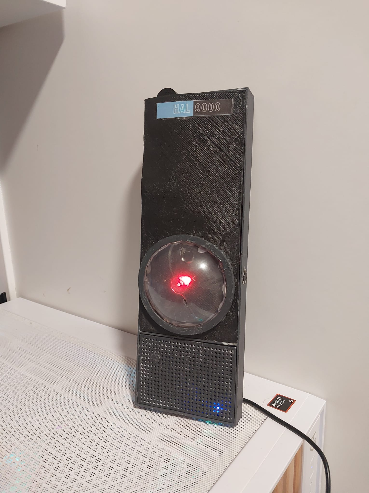

# HomeMade-HAL9000

Este proyecto está diseñado por withoutsleep y puedes usarlo como tú quieras :), eso sí, si puedes dame créditos porfa :P. Este proyecto trata de diferentes componentes (algunos que se ponen en la Raspberry Pi y otros en el PC) para poder tener una comunicación estable entre los dos y, aparte, usarlo como mini asistente IA.

# Cómo preparar tu HAL

Esto es fácil. Primero de todo, tienes que descargar todos los archivos teniendo en cuenta cuáles van en la Raspberry Pi y cuáles en el PC, para comenzar.

# .PY para PC:
pcmain.py
transcribe.py
voice.py

Para descargar las dependencias: pip install -r requirements_pc.txt

Por tema de copyright, también tienes que crear un audio llamado hal_voice.wav, con un audio de 0:11 segundos (más o menos) con la voz que quieras usar o la voz de HAL mismo. Por desgracia yo no puedo publicar el archivo; el archivo lo tienes que dejar en la raíz del sistema.

# .PY para Raspberry
ear.py
raspberrymain.py
core.py

Para descargar las dependencias: pip install -r requirements_ear.txt pip install -r requirements_raspberrymain.txt

# Más info

Para cada uno de estos archivos hay que descargar las dependencias que usan con pip, y en cada uno de estos tienes que modificar la variable IP (existen 2: ippc y ipraspberry). Simplemente tienes que conseguir la IP de Tailscale de estos dos con tailscale status e insertarlas en el código.

# LM-STUDIO

Para que el proyecto te funcione, tienes que instalar LM Studio y cargar el modelo de IA que quieres usar.

# Ejecutarlo

Una vez tengas todo hecho, tienes que ejecutar en la Raspberry Pi ear.py y en el PC transcribe.py. Si los dos funcionan, simplemente picando al botón de HAL (si no quieres usar el botón puedes modificar ear.py), puedes preguntarle cualquier cosa :)

# Montaje

No hay mucho que decir. Solo tienes que conectar el LED rojo de HAL al pin GPIO 17 (o modificar el código core.py para usar otro GPIO) y para conectar el botón tienes que usar el pin GPIO 27 (o modificar el código de ear.py para usar otro GPIO).

# Nota final

Este proyecto es modular y puedes agregar lo que quieras, así que no te desanimes, ¡y prueba a ver qué puedes hacer!, Si quieres cambiar el comportamiento de hal te recomiendo modificar pc/memory/context.txt

# Vídeo del proyecto

Puedes ver un poco más aquí:
https://www.youtube.com/watch?v=KlUB3jD_bqU&t=2s
